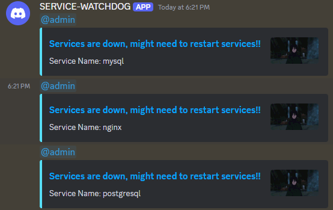

# Service Watchdog

A simple Go tool to keep an eye on your services on Linux systems.

## Environment Setup

Create a `.env` file in the root directory with your Discord WebHook

```plaintext
WebhookUrl=https://discord.com/api/webhooks/*
```
+ Services to monitor can be configured in `utils/constants.go`
+ Define roles for Discord notifications in `utils/constants.go`
+ Adjust Discord embed configurations in `utils/discord.go` to define the content of notifications.
```sh
go build main.go
./main
```


Pull Requests are always welcome.